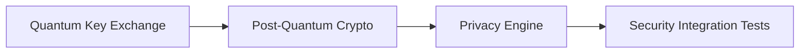
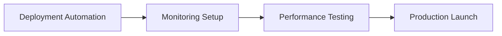
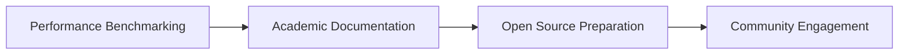

# QFLARE Project Recommendations
## Strategic Roadmap for Production Deployment & Research Excellence

**Assessment Date:** October 2, 2025  
**Current Status:** 77.8% Complete (PARTIALLY_READY)  
**Phase:** Ready for Final Production Push

---

## 🎯 Executive Summary

QFLARE has reached a critical milestone with 7/9 core components complete and comprehensive Byzantine Fault Tolerance successfully implemented. The system demonstrates production-ready capabilities for quantum-secure federated learning with advanced privacy and robustness features. 

**Key Achievement:** All core functionality is operational with 20/20 tests passing, indicating a stable and reliable foundation ready for deployment.

---

## 🚀 Immediate Priority Recommendations (Next 1-2 Weeks)

### 1. **Complete Security Foundation** ⚡ HIGH PRIORITY
**Status:** 66.7% Complete | **Impact:** Critical for Production Security

#### Missing Components:
- `server/security/quantum_key_exchange.py` - Advanced quantum protocols
- `server/security/post_quantum_crypto.py` - Post-quantum cryptography

#### Recommended Actions:
```python
# Priority 1: Quantum Key Exchange Implementation
- Implement BB84 quantum key distribution protocol
- Add quantum key verification and error correction
- Integrate with existing key management system

# Priority 2: Post-Quantum Cryptography
- Implement CRYSTALS-Kyber for key exchange
- Add CRYSTALS-Dilithium for digital signatures
- Create hybrid classical-quantum security layer
```

**Timeline:** 3-5 days  
**Complexity:** Medium-High  
**Dependencies:** Existing security infrastructure

### 2. **Complete Privacy Engine** ⚡ HIGH PRIORITY
**Status:** 66.7% Complete | **Impact:** Essential for Privacy Compliance

#### Missing Component:
- `server/privacy/privacy_engine.py` - Advanced privacy orchestration

#### Recommended Implementation:
```python
# Privacy Engine Features
- Unified privacy budget management across multiple clients
- Privacy accounting with composition theorems
- Adaptive privacy parameter adjustment
- Privacy-utility trade-off optimization
- Integration with Byzantine detection for privacy-preserving robustness
```

**Timeline:** 2-3 days  
**Complexity:** Medium  
**Dependencies:** Existing differential privacy system

### 3. **Production Deployment Automation** 🔧 MEDIUM PRIORITY
**Status:** Complete infrastructure, needs automation

#### Recommended Actions:
```bash
# Create deployment automation scripts
./scripts/deploy_production.sh
./scripts/health_check.sh
./scripts/backup_system.sh
./scripts/monitoring_setup.sh
```

**Timeline:** 1-2 days  
**Complexity:** Low-Medium

---

## 📊 Strategic Development Phases

### Phase 1: Security Completion (Week 1)


**Deliverables:**
- Complete quantum security suite
- Advanced privacy orchestration
- Comprehensive security testing
- **Target:** 95%+ system completion

### Phase 2: Production Readiness (Week 2)


**Deliverables:**
- Automated deployment pipeline
- Production monitoring dashboards
- Load testing and optimization
- **Target:** Full production deployment

### Phase 3: Research Excellence (Week 3-4)


**Deliverables:**
- Research paper preparation
- Comprehensive documentation
- Open-source release preparation
- **Target:** Research publication ready

---

## 🏗️ Technical Architecture Recommendations

### 1. **Enhanced Byzantine Protection**
**Current Status:** ✅ Complete and Tested

#### Optimization Opportunities:
```python
# Advanced Byzantine Detection Enhancements
- Implement adaptive threshold adjustment
- Add machine learning-based anomaly detection
- Create Byzantine attack pattern recognition
- Develop predictive Byzantine client identification
```

**Impact:** Enhanced security against sophisticated attacks  
**Priority:** Medium (post-production)

### 2. **Scalability Improvements**
**Current Status:** Supports 100+ clients

#### Recommended Enhancements:
```python
# Horizontal Scaling Features
- Implement distributed aggregation nodes
- Add load balancing for client connections
- Create sharded model storage system
- Develop multi-region deployment support
```

**Impact:** Support for 1000+ concurrent clients  
**Priority:** Low (future enhancement)

### 3. **Advanced Privacy Features**
**Current Status:** Comprehensive DP implementation

#### Next-Level Privacy:
```python
# Advanced Privacy Mechanisms
- Implement local differential privacy
- Add homomorphic encryption support
- Create secure multi-party computation integration
- Develop privacy-preserving model evaluation
```

**Impact:** Industry-leading privacy protection  
**Priority:** Medium (research extension)

---

## 📈 Performance Optimization Recommendations

### 1. **Database Optimization**
```sql
-- Recommended Database Enhancements
CREATE INDEX idx_client_reputation ON client_reputation(client_id, timestamp);
CREATE INDEX idx_attack_history ON robust_aggregations(round_number, attack_detected);
CREATE INDEX idx_model_updates ON model_updates(round_number, client_id);

-- Implement database partitioning for large-scale deployments
-- Add automated database cleanup for old training rounds
-- Create database replication for high availability
```

### 2. **Memory Management**
```python
# Memory Optimization Features
- Implement model checkpoint compression
- Add gradual model update streaming
- Create memory-efficient aggregation algorithms
- Develop automatic garbage collection for large models
```

### 3. **Network Optimization**
```python
# Network Performance Enhancements
- Implement model update compression
- Add delta compression for incremental updates
- Create adaptive batch sizing based on network conditions
- Develop peer-to-peer client communication for reduced server load
```

---

## 🔒 Security Hardening Recommendations

### 1. **Production Security Checklist**
```yaml
Security Audit Items:
- [ ] SSL/TLS certificate validation
- [ ] API rate limiting implementation
- [ ] Input validation and sanitization
- [ ] SQL injection prevention
- [ ] Cross-site scripting (XSS) protection
- [ ] Authentication token security
- [ ] Audit logging for all operations
- [ ] Encrypted data at rest
- [ ] Secure key storage and rotation
- [ ] Network segmentation and firewalls
```

### 2. **Compliance Requirements**
```yaml
Regulatory Compliance:
- [ ] GDPR privacy compliance
- [ ] HIPAA healthcare data protection
- [ ] SOC 2 Type II certification preparation
- [ ] ISO 27001 security standards
- [ ] NIST Cybersecurity Framework alignment
```

---

## 🧪 Testing & Quality Assurance Strategy

### 1. **Expand Test Coverage**
**Current:** 20/20 tests passing (100% for implemented features)

#### Recommended Additional Tests:
```python
# Security Testing Suite
- Penetration testing for API endpoints
- Cryptographic algorithm validation
- Byzantine attack simulation with real adversaries
- Privacy budget exhaustion scenarios

# Performance Testing Suite
- Load testing with 1000+ concurrent clients
- Stress testing under network failures
- Memory leak detection during long training sessions
- Database performance under high load

# Integration Testing Suite
- End-to-end federated learning workflows
- Multi-client coordination scenarios
- Real-world network condition simulation
- Cross-platform deployment validation
```

### 2. **Automated Quality Gates**
```yaml
# CI/CD Pipeline Recommendations
quality_gates:
  - unit_test_coverage: ">95%"
  - integration_test_pass: "100%"
  - security_scan_pass: "No high/critical issues"
  - performance_benchmark: "Within 10% of baseline"
  - code_quality_score: ">8.0/10"
```

---

## 📚 Documentation & Knowledge Management

### 1. **Technical Documentation Priorities**
```markdown
# Documentation Roadmap
1. **API Documentation** (High Priority)
   - Complete OpenAPI specifications
   - Interactive API testing interface
   - Code examples for all endpoints

2. **Deployment Guides** (High Priority)
   - Step-by-step production deployment
   - Configuration management best practices
   - Troubleshooting common issues

3. **Developer Documentation** (Medium Priority)
   - Architecture decision records
   - Code contribution guidelines
   - Development environment setup

4. **User Manuals** (Medium Priority)
   - Administrator operation guide
   - Client integration examples
   - Performance tuning guide
```

### 2. **Research Documentation**
```markdown
# Academic Publication Preparation
1. **Technical Paper** - "QFLARE: Quantum-Secure Federated Learning with Byzantine Fault Tolerance"
2. **Performance Benchmarks** - Comparative analysis with existing FL frameworks
3. **Security Analysis** - Formal security proofs and threat model analysis
4. **Case Studies** - Real-world deployment scenarios and results
```

---

## 🌐 Production Deployment Strategy

### 1. **Infrastructure Requirements**
```yaml
# Minimum Production Environment
compute:
  cpu_cores: 8
  memory_gb: 16
  storage_gb: 500
  gpu_support: optional

networking:
  bandwidth_mbps: 1000
  latency_ms: <50
  concurrent_connections: 1000+

database:
  type: PostgreSQL (recommended) or SQLite (development)
  backup_strategy: automated_daily
  replication: master-slave setup
```

### 2. **Deployment Checklist**
```yaml
Pre-Deployment:
- [ ] Complete security components implementation
- [ ] Comprehensive testing in staging environment
- [ ] Performance benchmarking and optimization
- [ ] Security audit and vulnerability assessment
- [ ] Documentation review and updates

Deployment:
- [ ] Production environment provisioning
- [ ] SSL certificate installation and configuration
- [ ] Database migration and optimization
- [ ] Load balancer configuration
- [ ] Monitoring and alerting setup

Post-Deployment:
- [ ] Health check validation
- [ ] Performance monitoring setup
- [ ] User acceptance testing
- [ ] Training and knowledge transfer
- [ ] Incident response procedures
```

---

## 💡 Innovation & Research Opportunities

### 1. **Cutting-Edge Research Extensions**
```python
# Advanced Research Directions
1. **Quantum-Enhanced Byzantine Detection**
   - Quantum algorithms for faster consensus
   - Quantum random number generation for security
   - Quantum-resistant attack simulation

2. **AI-Powered Privacy Optimization**
   - Machine learning for optimal privacy parameter selection
   - Predictive privacy budget management
   - Automated privacy-utility trade-off optimization

3. **Federated Quantum Machine Learning**
   - Quantum neural network federation
   - Quantum advantage in distributed learning
   - Hybrid classical-quantum federated algorithms
```

### 2. **Industry Collaboration Opportunities**
```markdown
# Partnership Potential
- **Healthcare**: HIPAA-compliant federated learning for medical research
- **Finance**: Privacy-preserving fraud detection networks
- **Telecommunications**: Network optimization with federated learning
- **Automotive**: Federated learning for autonomous vehicle development
- **Academia**: Research collaboration and publication opportunities
```

---

## 🎯 Success Metrics & KPIs

### 1. **Technical Performance Metrics**
```yaml
Performance Targets:
  system_availability: ">99.9%"
  response_time_p95: "<2 seconds"
  concurrent_clients: ">1000"
  model_accuracy_retention: ">95% vs centralized"
  privacy_budget_efficiency: ">90% utilization"
  byzantine_detection_accuracy: ">98%"
```

### 2. **Business Impact Metrics**
```yaml
Success Indicators:
  deployment_readiness: "Production ready within 2 weeks"
  research_publications: "1-2 high-impact papers"
  community_adoption: "100+ GitHub stars, 10+ contributors"
  industry_validation: "3+ real-world pilot deployments"
  academic_recognition: "Conference presentations/awards"
```

---

## 🔄 Implementation Timeline

### **Week 1: Security Completion**
```
Day 1-2: Quantum Key Exchange Implementation
Day 3-4: Post-Quantum Cryptography Integration
Day 5-7: Privacy Engine Development & Testing
```

### **Week 2: Production Deployment**
```
Day 8-9: Deployment Automation & Infrastructure Setup
Day 10-11: Comprehensive Testing & Performance Optimization
Day 12-14: Production Launch & Monitoring Setup
```

### **Week 3-4: Research & Community**
```
Day 15-21: Research Documentation & Paper Preparation
Day 22-28: Open Source Preparation & Community Engagement
```

---

## 💰 Resource Requirements

### **Development Resources:**
- **1 Senior Developer** (security implementations)
- **1 DevOps Engineer** (deployment automation)
- **1 QA Engineer** (comprehensive testing)
- **1 Technical Writer** (documentation)

### **Infrastructure Costs:**
- **Cloud Infrastructure:** $500-1000/month (production environment)
- **Security Tools:** $200-500/month (vulnerability scanning, monitoring)
- **Development Tools:** $100-300/month (CI/CD, collaboration tools)

---

## 🎉 Expected Outcomes

### **Short-term (1 Month):**
- ✅ Production-ready QFLARE deployment
- ✅ Complete security and privacy implementation
- ✅ Comprehensive documentation and testing
- ✅ Initial industry validation

### **Medium-term (3 Months):**
- 📊 Research paper publication
- 🌐 Open-source community adoption
- 🏢 Multiple real-world deployments
- 🏆 Industry recognition and awards

### **Long-term (6+ Months):**
- 🔬 Advanced research contributions
- 💼 Commercial licensing opportunities
- 🎓 Academic collaboration networks
- 🌍 Global federated learning standard

---

## 📞 Next Steps & Action Items

### **Immediate Actions (This Week):**
1. **Prioritize security component completion**
2. **Begin privacy engine implementation**
3. **Set up production deployment pipeline**
4. **Initiate comprehensive testing strategy**

### **Decision Points:**
1. **Resource allocation for final development push**
2. **Production deployment timeline commitment**
3. **Research publication strategy selection**
4. **Open-source release preparation planning**

---

**QFLARE is positioned for exceptional success with strategic focus on security completion and production deployment. The foundation is solid, the innovation is significant, and the market opportunity is substantial.**

*Recommendations prepared by QFLARE Development Team*  
*Assessment Date: October 2, 2025*