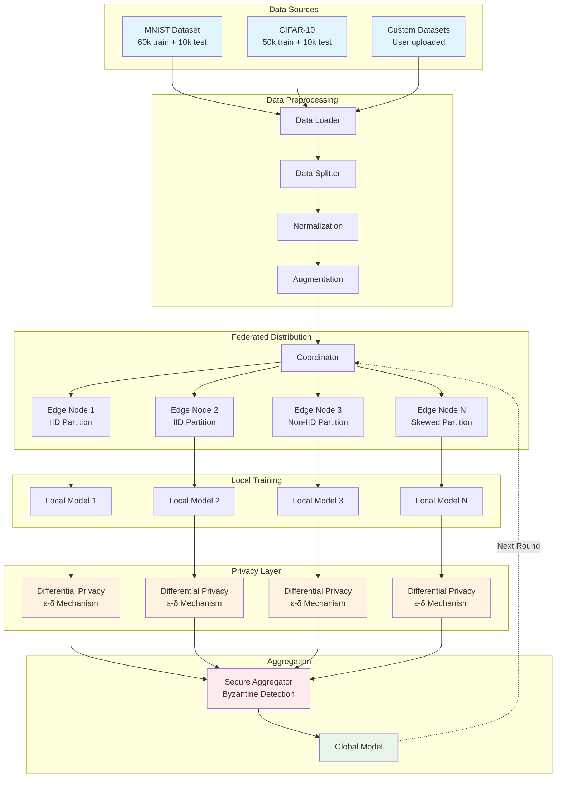
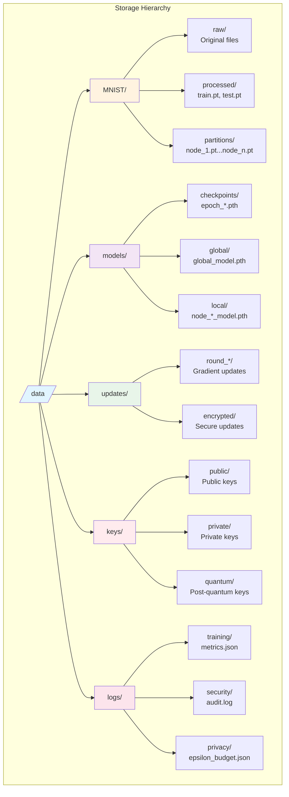
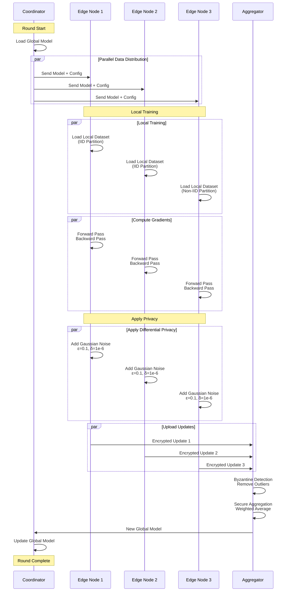
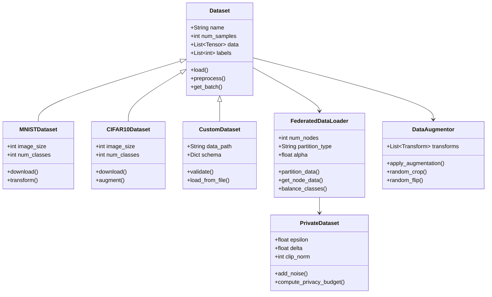
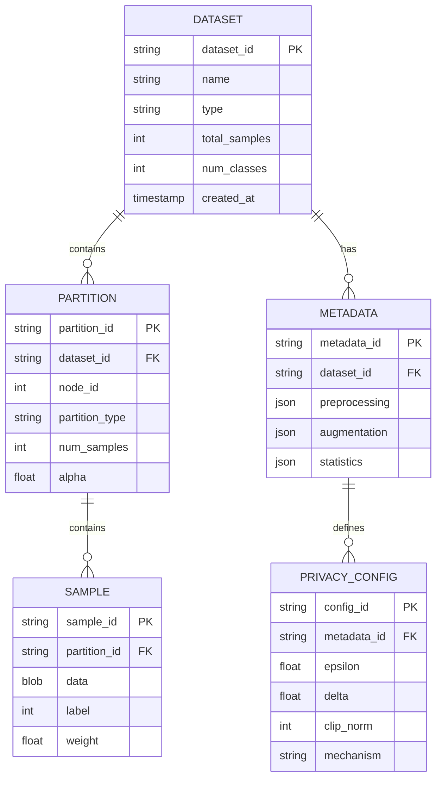
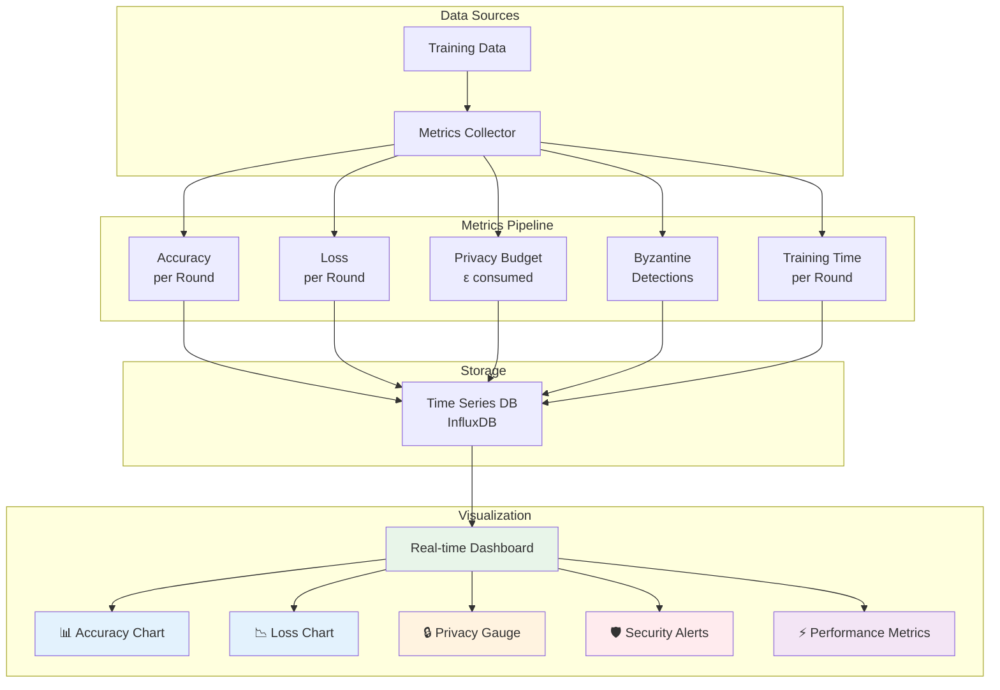

# QFLARE Dataset Architecture - Mermaid Diagrams

## 1. Overall Dataset Flow Architecture



## 2. Data Partitioning Strategies

```mermaid
graph LR
    subgraph "Dataset"
        D[Original Dataset<br/>D = {x₁, x₂, ..., xₙ}]
    end
    
    subgraph "IID Partitioning"
        D --> IID_Split[Random Shuffle<br/>& Equal Split]
        IID_Split --> IID1[Partition 1<br/>Uniform Distribution]
        IID_Split --> IID2[Partition 2<br/>Uniform Distribution]
        IID_Split --> IID3[Partition 3<br/>Uniform Distribution]
    end
    
    subgraph "Non-IID Partitioning"
        D --> NIID_Split[Class-based Split<br/>Dirichlet α=0.5]
        NIID_Split --> NIID1[Partition 1<br/>Classes: 0,1,2]
        NIID_Split --> NIID2[Partition 2<br/>Classes: 3,4,5]
        NIID_Split --> NIID3[Partition 3<br/>Classes: 6,7,8,9]
    end
    
    subgraph "Quantity Skewed"
        D --> QS_Split[Unequal Split<br/>Power Law]
        QS_Split --> QS1[Partition 1<br/>50% data]
        QS_Split --> QS2[Partition 2<br/>30% data]
        QS_Split --> QS3[Partition 3<br/>20% data]
    end
    
    style D fill:#e3f2fd
    style IID1 fill:#c8e6c9
    style IID2 fill:#c8e6c9
    style IID3 fill:#c8e6c9
    style NIID1 fill:#ffccbc
    style NIID2 fill:#ffccbc
    style NIID3 fill:#ffccbc
    style QS1 fill:#f0f4c3
    style QS2 fill:#f0f4c3
    style QS3 fill:#f0f4c3
```

## 3. Dataset Storage Structure



## 4. Data Flow During Federated Training



## 5. Dataset Class Structure



## 6. Privacy Budget Flow

```mermaid
graph TD
    subgraph "Privacy Budget Management"
        Init[Initialize Budget<br/>ε_total = 1.0<br/>δ = 1e-6]
        
        Init --> Round1[Round 1]
        Round1 --> Consume1[Consume: ε₁ = 0.1]
        Consume1 --> Remain1[Remaining: 0.9]
        
        Remain1 --> Round2[Round 2]
        Round2 --> Consume2[Consume: ε₂ = 0.1]
        Consume2 --> Remain2[Remaining: 0.8]
        
        Remain2 --> Round3[Round 3]
        Round3 --> Consume3[Consume: ε₃ = 0.1]
        Consume3 --> Remain3[Remaining: 0.7]
        
        Remain3 --> RoundN[Round N]
        RoundN --> ConsumeN[Consume: εₙ = 0.1]
        ConsumeN --> RemainN[Remaining: ε_remain]
        
        RemainN --> Check{ε_remain > 0?}
        Check -->|Yes| Continue[Continue Training]
        Check -->|No| Stop[Stop Training<br/>Budget Exhausted]
        
        Continue --> RoundN
    end
    
    style Init fill:#e8f5e9
    style Stop fill:#ffebee
    style Continue fill:#e3f2fd
```



## 7. Dataset Metadata Schema



## 8. Byzantine Detection on Dataset

```mermaid
graph TB
    subgraph "Update Collection"
        U1[Update 1<br/>Node 1]
        U2[Update 2<br/>Node 2]
        U3[Update 3<br/>Node 3 - Byzantine]
        U4[Update 4<br/>Node 4]
        UN[Update N<br/>Node N]
    end
    
    subgraph "Statistical Analysis"
        U1 --> Stats[Compute Statistics]
        U2 --> Stats
        U3 --> Stats
        U4 --> Stats
        UN --> Stats
        
        Stats --> Mean[Mean: μ]
        Stats --> Std[Std Dev: σ]
        Stats --> Median[Median: m]
    end
    
    subgraph "Outlier Detection"
        Mean --> Z[Z-Score Test<br/>|z| > 3?]
        Std --> Z
        
        Z --> Check1{U1 Normal?}
        Z --> Check2{U2 Normal?}
        Z --> Check3{U3 Outlier?}
        Z --> Check4{U4 Normal?}
        Z --> CheckN{UN Normal?}
        
        Check1 -->|Yes| Accept1[✓ Accept]
        Check2 -->|Yes| Accept2[✓ Accept]
        Check3 -->|No| Reject3[✗ Reject Byzantine]
        Check4 -->|Yes| Accept4[✓ Accept]
        CheckN -->|Yes| AcceptN[✓ Accept]
    end
    
    subgraph "Aggregation"
        Accept1 --> Agg[Weighted Average]
        Accept2 --> Agg
        Accept4 --> Agg
        AcceptN --> Agg
        
        Agg --> Final[Final Model Update]
    end
    
    Reject3 --> Log[Security Log<br/>Byzantine Attack Detected]
    
    style U3 fill:#ffebee
    style Check3 fill:#ffccbc
    style Reject3 fill:#ef5350
    style Log fill:#ffcdd2
    style Accept1 fill:#c8e6c9
    style Accept2 fill:#c8e6c9
    style Accept4 fill:#c8e6c9
    style AcceptN fill:#c8e6c9
    style Final fill:#a5d6a7
```

## 9. Data Encryption Pipeline

```mermaid
graph LR
    subgraph "Plain Data"
        Plain[Local Dataset<br/>Unencrypted]
    end
    
    subgraph "Encryption Layers"
        Plain --> Layer1[Layer 1: AES-256<br/>Symmetric Encryption]
        Layer1 --> Layer2[Layer 2: RSA-4096<br/>Key Encryption]
        Layer2 --> Layer3[Layer 3: CRYSTALS-Kyber<br/>Post-Quantum]
    end
    
    subgraph "Secure Storage"
        Layer3 --> Store[Encrypted Storage<br/>Triple-Layer Protection]
    end
    
    subgraph "Transmission"
        Store --> TLS[TLS 1.3<br/>Transport Layer]
        TLS --> Network[Network<br/>Secure Channel]
    end
    
    subgraph "Decryption"
        Network --> D_Layer3[Decrypt: Kyber]
        D_Layer3 --> D_Layer2[Decrypt: RSA]
        D_Layer2 --> D_Layer1[Decrypt: AES]
        D_Layer1 --> Receiver[Receiver Node<br/>Plain Data]
    end
    
    style Plain fill:#e3f2fd
    style Layer1 fill:#fff3e0
    style Layer2 fill:#f3e5f5
    style Layer3 fill:#ffebee
    style Store fill:#e8f5e9
    style Receiver fill:#e3f2fd
```



## 10. Real-time Dataset Metrics Dashboard



---

## Usage Instructions

### Render these diagrams:

1. **GitHub/GitLab**: Automatically renders in `.md` files
2. **VS Code**: Install "Markdown Preview Mermaid Support" extension
3. **Online**: Copy to https://mermaid.live
4. **Documentation**: Use in MkDocs, Docusaurus, or Sphinx

### Customize:

```javascript
// Adjust theme in your markdown file
<script>
  mermaid.initialize({ theme: 'dark' });
</script>
```

---

*Generated for QFLARE Project - November 1, 2025*
