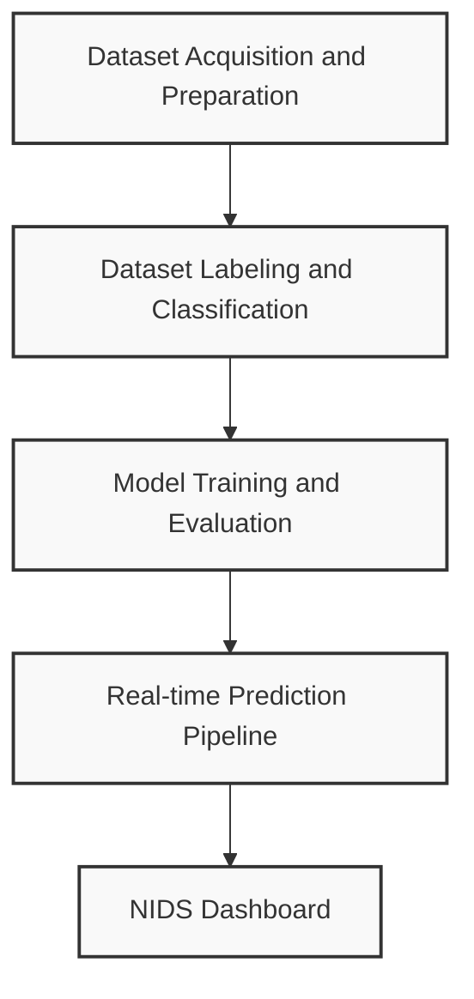
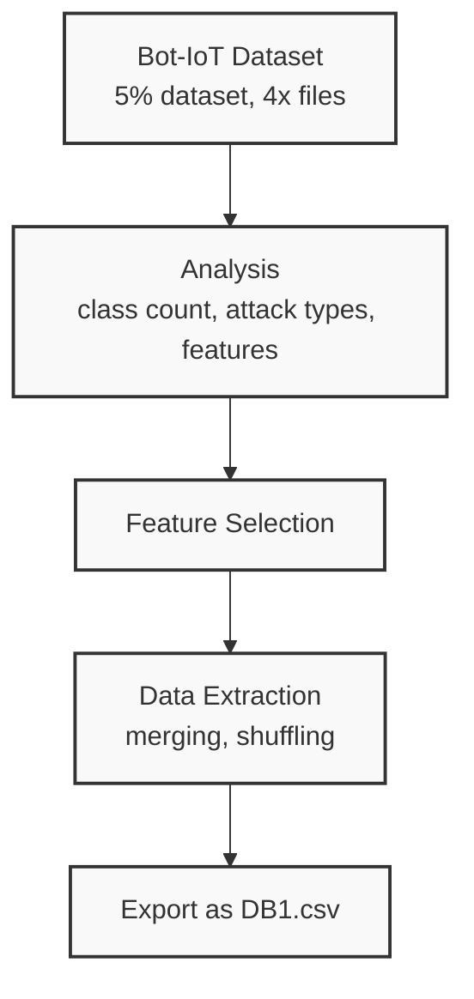
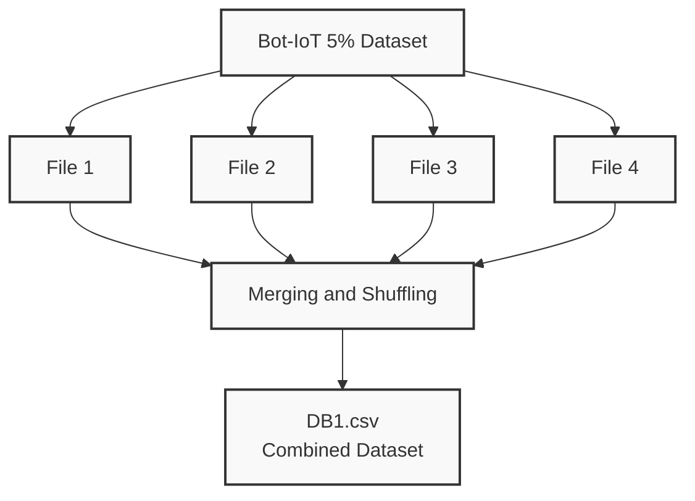
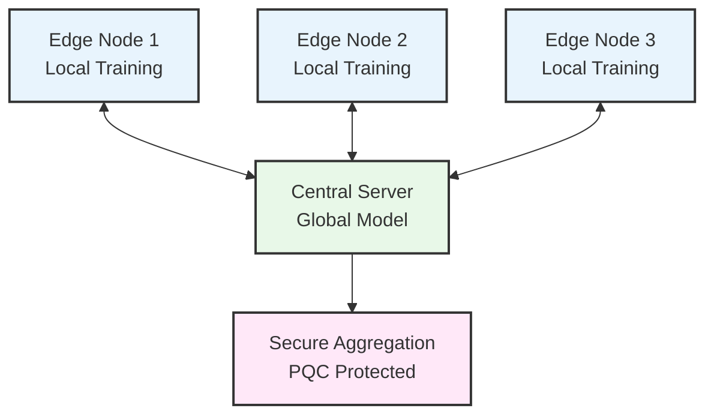
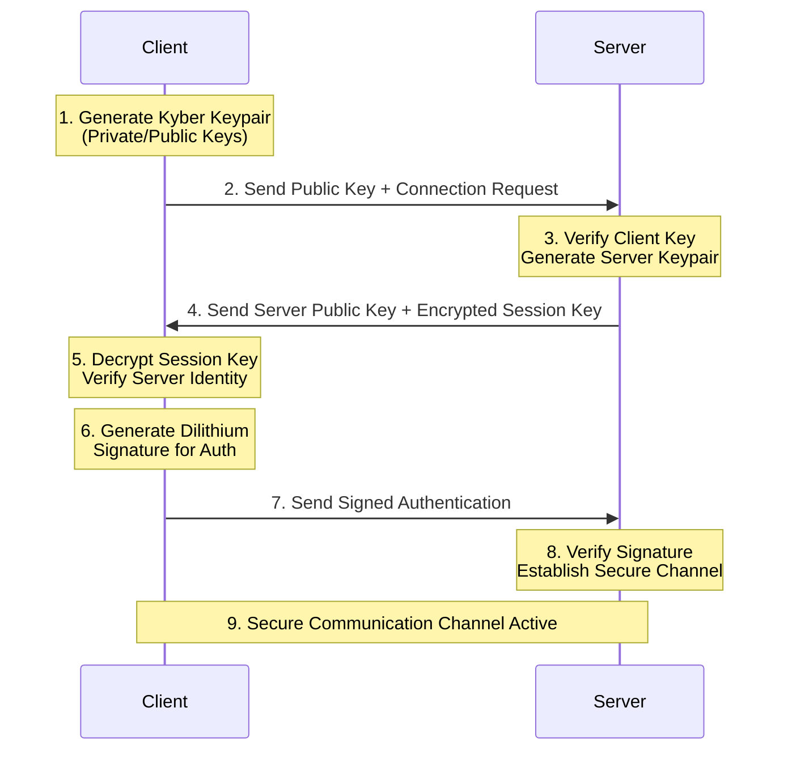
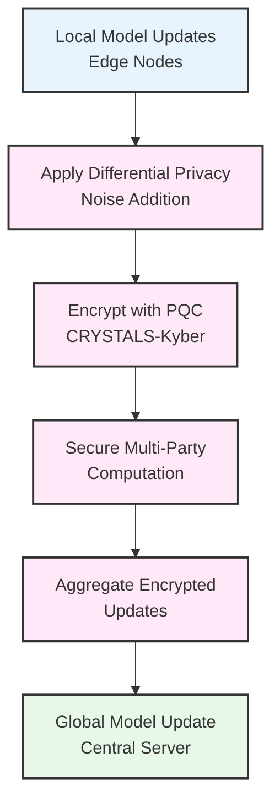
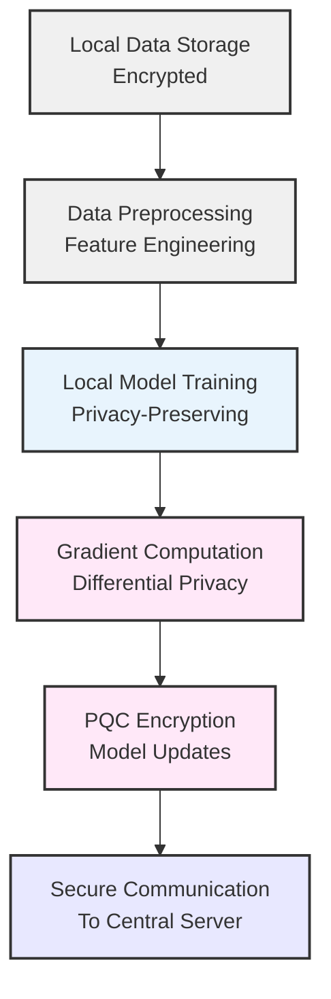
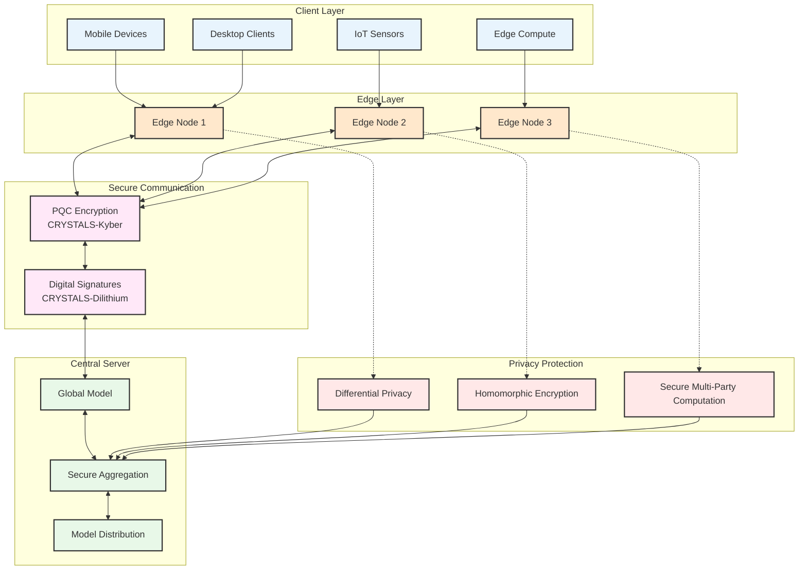
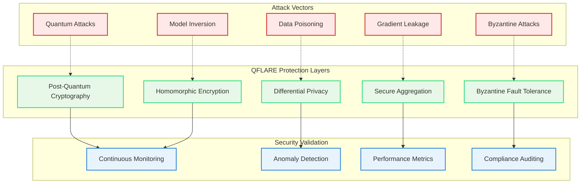

# QFLARE System Architecture - Mermaid Diagrams

This document contains all QFLARE system diagrams in Mermaid format for easy integration into documentation, presentations, and markdown files.

## 1. Overall System Block Diagram

## 2. Data Acquisition and Preparation

## 3. Combined Dataset Creation

## 4. QFLARE Federated Learning Flow

## 5. PQC Handshake Protocol (No Response Times)

## 6. Secure Aggregation Process

## 7. Edge Node Architecture

## 8. QFLARE System Architecture Overview

## 9. Threat Model and Security Layers

## Usage Instructions

### For GitHub/GitLab/Documentation
- Copy any diagram code block and paste it into your markdown files
- The diagrams will render automatically in most modern markdown viewers
- GitHub, GitLab, and most documentation platforms support Mermaid natively

### For Presentations
- Use Mermaid Live Editor (https://mermaid.live) to generate PNG/SVG files
- Copy the code, paste into the editor, and download the rendered image
- Perfect for PowerPoint, Google Slides, or any presentation software

### For Web Integration
- Include Mermaid.js library in your web pages
- Paste the diagram code directly into your HTML/markdown content
- Diagrams will render client-side with full interactivity

### Color Coding
- **Light Blue (#e8f4fd)**: Client/Edge components
- **Light Orange (#ffe8cc)**: Edge processing nodes  
- **Light Green (#e8f8e8)**: Central server components
- **Light Pink (#ffe8f8)**: Cryptographic/Security components
- **Light Gray (#f0f0f0)**: Data storage/processing
- **Light Red (#ffe8e8)**: Security threats/monitoring

All diagrams are designed for professional documentation and presentations with clean, consistent styling.