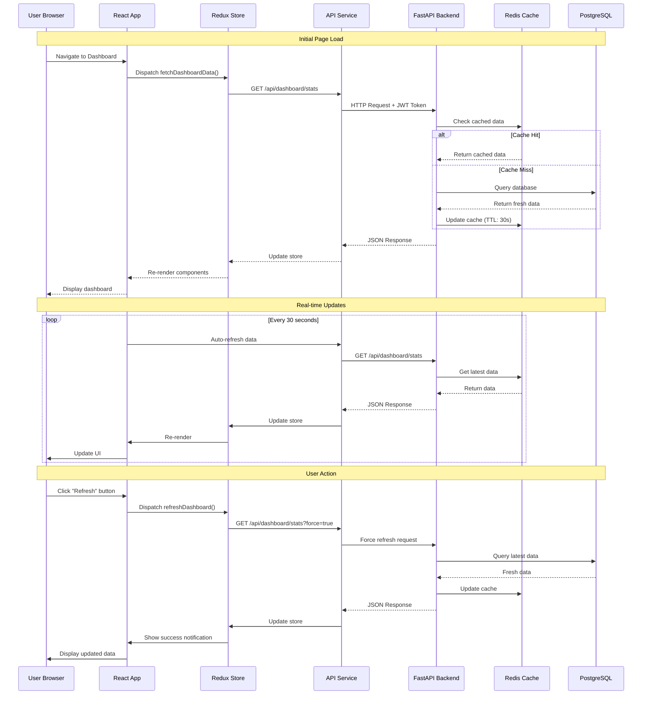
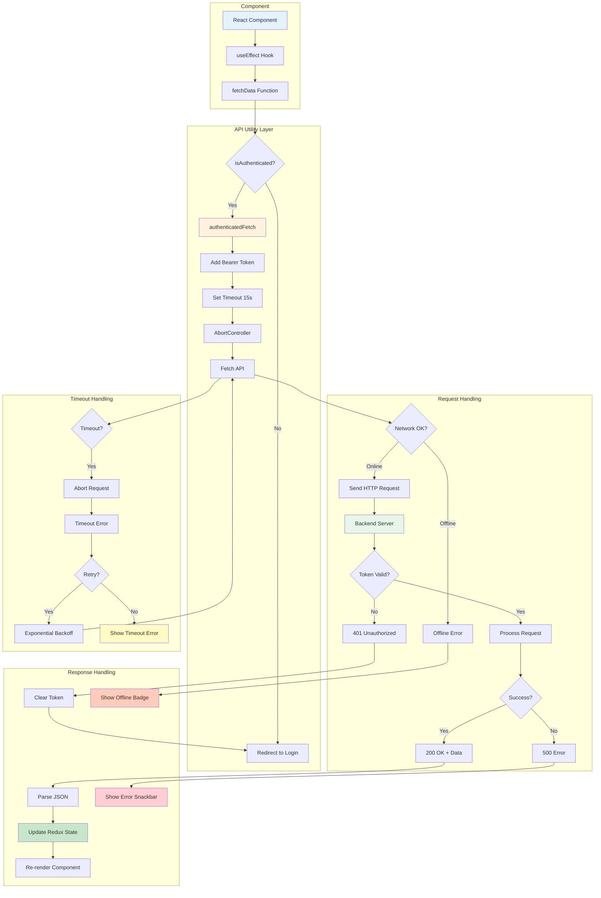
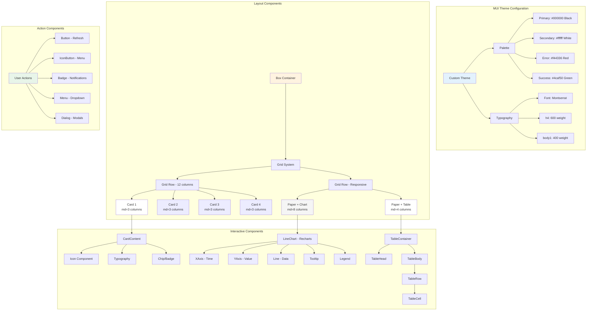
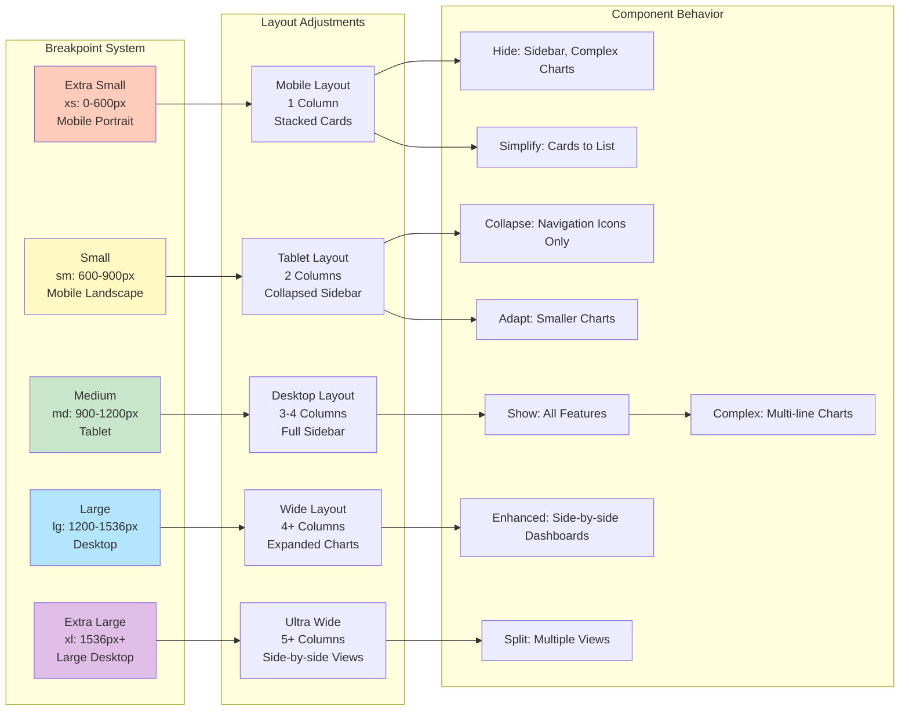
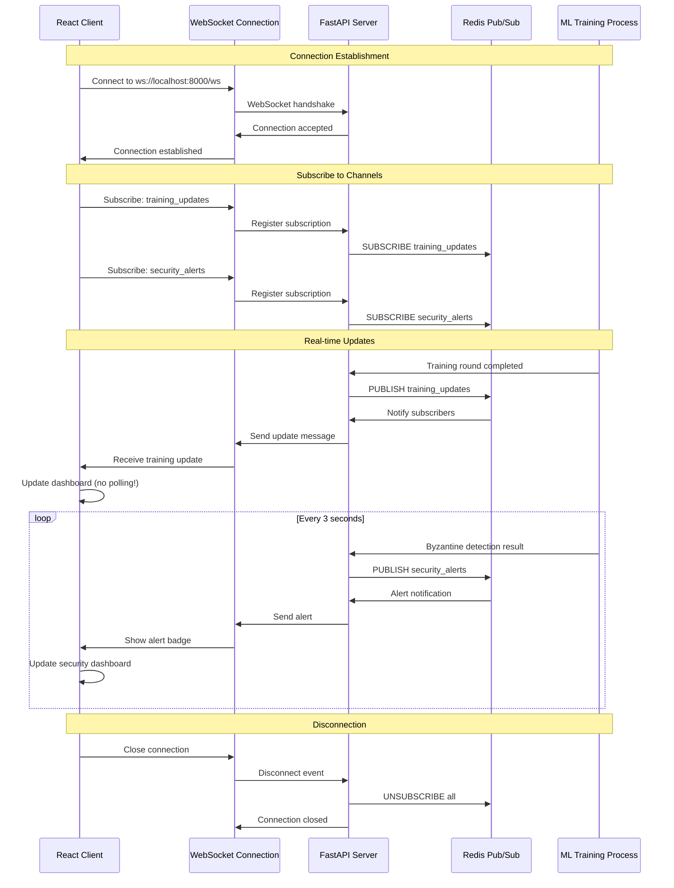
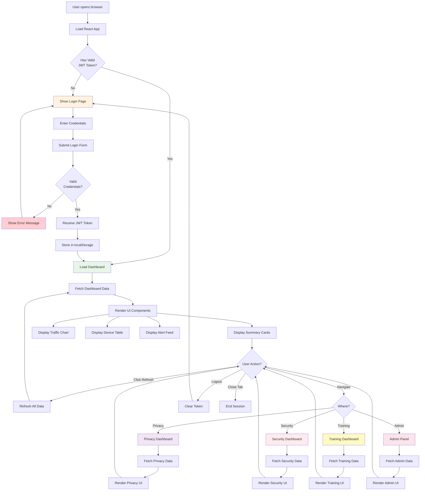

# QFLARE Website Architecture - Mermaid Diagrams

## 1. Complete Website Architecture

```mermaid
graph TB
    subgraph "Client Layer"
        Browser[Web Browser<br/>Chrome/Firefox/Safari]
        Browser --> React[React Application<br/>Port 3000]
    end
    
    subgraph "Frontend - React SPA"
        React --> Router[React Router]
        
        Router --> Login[Login Page<br/>/login]
        Router --> Dashboard[Main Dashboard<br/>/dashboard]
        Router --> Privacy[Privacy Dashboard<br/>/privacy]
        Router --> Security[Security Dashboard<br/>/security]
        Router --> Training[Training Dashboard<br/>/training]
        Router --> Admin[Admin Panel<br/>/admin]
        
        Dashboard --> Components[Reusable Components]
        Components --> Cards[Summary Cards]
        Components --> Charts[Traffic Charts]
        Components --> Tables[Device Lists]
        Components --> Alerts[Alert Feed]
        Components --> Notif[Notification Bell]
    end
    
    subgraph "State Management"
        Components --> Redux[Redux Store]
        Redux --> AuthSlice[Auth State]
        Redux --> DataSlice[Dashboard Data]
        Redux --> UISlice[UI State]
    end
    
    subgraph "API Layer"
        Components --> API[API Service<br/>utils/api.ts]
        API --> Auth[Authentication<br/>JWT Tokens]
        API --> Timeout[Request Timeout<br/>5-20s]
        API --> Retry[Retry Logic<br/>Exponential Backoff]
    end
    
    subgraph "Backend - FastAPI"
        API --> FastAPI[FastAPI Server<br/>Port 8000]
        
        FastAPI --> AuthAPI[/api/auth/*<br/>Login/Register]
        FastAPI --> PrivacyAPI[/api/privacy/*<br/>Metrics/Budget]
        FastAPI --> SecurityAPI[/api/security/*<br/>Byzantine/Audit]
        FastAPI --> TrainingAPI[/api/training/*<br/>Start/Stop/Status]
        FastAPI --> NotifAPI[/api/notifications<br/>Alerts]
        FastAPI --> AdminAPI[/api/admin/*<br/>User Management]
    end
    
    subgraph "Database Layer"
        AuthAPI --> DB[(PostgreSQL<br/>Users & Sessions)]
        TrainingAPI --> DB
        AdminAPI --> DB
        
        PrivacyAPI --> Redis[(Redis<br/>Real-time Data)]
        SecurityAPI --> Redis
        NotifAPI --> Redis
    end
    
    subgraph "ML/Training Layer"
        TrainingAPI --> FL[Federated Learning<br/>Coordinator]
        FL --> Edge1[Edge Node 1]
        FL --> Edge2[Edge Node 2]
        FL --> EdgeN[Edge Node N]
    end
    
    style Browser fill:#e3f2fd
    style React fill:#e1f5ff
    style Dashboard fill:#fff3e0
    style Privacy fill:#f3e5f5
    style Security fill:#ffebee
    style Training fill:#e8f5e9
    style Admin fill:#fce4ec
    style FastAPI fill:#fff3e0
    style DB fill:#e8f5e9
    style Redis fill:#ffebee
```

## 2. Dashboard Component Architecture (Based on NIDS Control Center)

```mermaid
graph TB
    subgraph "Main Dashboard Layout"
        Header[Header Bar<br/>Logo + User + Notifications]
        
        Header --> TopRow[Top Statistics Row]
        TopRow --> Card1[Packet Loss<br/>111]
        TopRow --> Card2[Network Traffic<br/>23.4 KB]
        TopRow --> Card3[Bandwidth<br/>4]
        TopRow --> Card4[Stream Priority<br/>0]
        TopRow --> Card5[Others<br/>0]
        TopRow --> Card6[Unlearned Packets<br/>0]
        TopRow --> Card7[Notes<br/>]
        
        TopRow --> TrafficChart[Traffic Chart<br/>Time Series Visualization]
        TrafficChart --> ChartLib[Recharts Library]
        
        TrafficChart --> DeviceTable[Network Traffic Table]
        DeviceTable --> Col1[IP Column]
        DeviceTable --> Col2[Devices Column]
        DeviceTable --> Col3[Status Column]
        DeviceTable --> Col4[In/Out Traffic]
        
        DeviceTable --> AlertFeed[Alert Feed<br/>Real-time Updates]
        AlertFeed --> EmptyState[No alerts yet. Monitoring...]
    end
    
    style Header fill:#000000
    style Card1 fill:#ffffff
    style Card2 fill:#ffffff
    style Card3 fill:#ffffff
    style TrafficChart fill:#f5f5f5
    style DeviceTable fill:#ffffff
    style AlertFeed fill:#ffffff
```



## 3. Frontend Component Hierarchy

```mermaid
graph TB
    subgraph "App Component Tree"
        App[App.tsx<br/>Root Component]
        
        App --> AuthProvider[Auth Context Provider]
        AuthProvider --> ThemeProvider[MUI Theme Provider]
        ThemeProvider --> RouterProvider[Router Provider]
        
        RouterProvider --> Layout[Layout Component]
        
        Layout --> Navbar[Navigation Bar]
        Navbar --> Logo[QFLARE Logo]
        Navbar --> NavLinks[Navigation Links]
        Navbar --> UserMenu[User Menu Dropdown]
        Navbar --> NotifBell[Notification Bell]
        
        Layout --> Sidebar[Sidebar Menu]
        Sidebar --> DashLink[Dashboard]
        Sidebar --> PrivLink[Privacy]
        Sidebar --> SecLink[Security]
        Sidebar --> TrainLink[Training]
        Sidebar --> AdminLink[Admin]
        
        Layout --> MainContent[Main Content Area]
        
        MainContent --> DashPage[Dashboard Page]
        MainContent --> PrivPage[Privacy Page]
        MainContent --> SecPage[Security Page]
        MainContent --> TrainPage[Training Page]
        MainContent --> AdminPage[Admin Page]
        
        DashPage --> SummaryCards[Summary Cards Grid]
        SummaryCards --> MetricCard1[Packet Loss Card]
        SummaryCards --> MetricCard2[Traffic Card]
        SummaryCards --> MetricCard3[Bandwidth Card]
        
        DashPage --> TrafficViz[Traffic Visualization]
        TrafficViz --> LineChart[Line Chart Component]
        
        DashPage --> DeviceList[Device List Table]
        DeviceList --> TableHead[Table Header]
        DeviceList --> TableBody[Table Body]
        DeviceList --> TableRow[Table Rows]
        
        DashPage --> AlertSection[Alert Feed Section]
        AlertSection --> AlertList[Alert List]
        AlertSection --> AlertItem[Individual Alerts]
    end
    
    style App fill:#e3f2fd
    style Layout fill:#fff3e0
    style Navbar fill:#000000
    style Sidebar fill:#f5f5f5
    style MainContent fill:#ffffff
    style DashPage fill:#e8f5e9
    style PrivPage fill:#f3e5f5
    style SecPage fill:#ffebee
    style TrainPage fill:#fff9c4
    style AdminPage fill:#fce4ec
```



## 4. Data Flow - Real-time Dashboard Updates



## 5. Redux State Management Architecture

```mermaid
graph TB
    subgraph "Redux Store"
        Store[Redux Store<br/>Global State]
        
        Store --> Auth[Auth Slice]
        Store --> Dashboard[Dashboard Slice]
        Store --> Privacy[Privacy Slice]
        Store --> Security[Security Slice]
        Store --> Training[Training Slice]
        Store --> UI[UI Slice]
        Store --> Notifications[Notifications Slice]
    end
    
    subgraph "Auth Slice"
        Auth --> User[user: User | null]
        Auth --> Token[token: string | null]
        Auth --> IsAuth[isAuthenticated: boolean]
        Auth --> Loading[loading: boolean]
        Auth --> Error[error: string | null]
    end
    
    subgraph "Dashboard Slice"
        Dashboard --> Stats[stats: DashboardStats]
        Dashboard --> Traffic[trafficData: TimeSeriesData[]]
        Dashboard --> Devices[devices: Device[]]
        Dashboard --> Alerts[alerts: Alert[]]
        Dashboard --> RefreshTime[lastRefresh: timestamp]
    end
    
    subgraph "UI Slice"
        UI --> IsOnline[isOnline: boolean]
        UI --> Refreshing[refreshing: boolean]
        UI --> SidebarOpen[sidebarOpen: boolean]
        UI --> Theme[theme: 'light' | 'dark']
        UI --> Snackbar[snackbar: {open, message, severity}]
    end
    
    subgraph "Actions"
        Store --> Actions[Action Creators]
        Actions --> SyncActions[Sync Actions<br/>SET_USER, TOGGLE_SIDEBAR]
        Actions --> AsyncActions[Async Thunks<br/>fetchDashboard, login]
    end
    
    subgraph "Components"
        Store --> Selectors[Selectors]
        Selectors --> Comp1[useSelector Hook]
        Comp1 --> DashComp[Dashboard Component]
        Comp1 --> PrivComp[Privacy Component]
        Comp1 --> SecComp[Security Component]
    end
    
    style Store fill:#e3f2fd
    style Auth fill:#fff3e0
    style Dashboard fill:#e8f5e9
    style UI fill:#f3e5f5
    style Actions fill:#ffebee
    style Selectors fill:#fce4ec
```

## 6. API Request/Response Flow with Error Handling



## 7. Material-UI Component Structure



## 8. Responsive Design Breakpoints



## 9. WebSocket Real-time Communication (Future Enhancement)



## 10. Complete Page Flow - User Journey



---

## Usage Instructions

### Integration with your NIDS Control Center Design:

1. **Color Scheme**: Matches the black & white professional design
2. **Layout**: Mimics the packet loss, traffic, and device list structure
3. **Real-time Updates**: Shows how data flows from backend to frontend
4. **Component Structure**: Maps to actual React components in your codebase

### Rendering:

```bash
# Install VS Code extension
code --install-extension bierner.markdown-mermaid

# Or use online editor
https://mermaid.live

# Export as PNG/SVG for documentation
```

### Customization:

```javascript
// Adjust diagram theme
%%{init: {'theme':'dark'}}%%

// Or use custom theme
%%{init: {'theme':'base', 'themeVariables': { 'primaryColor':'#000'}}}%%
```

---

*Generated for QFLARE Dashboard - November 1, 2025*
