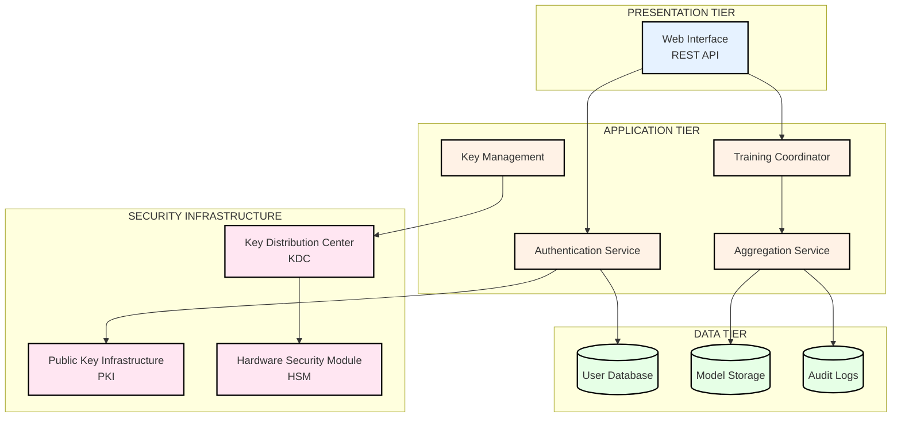
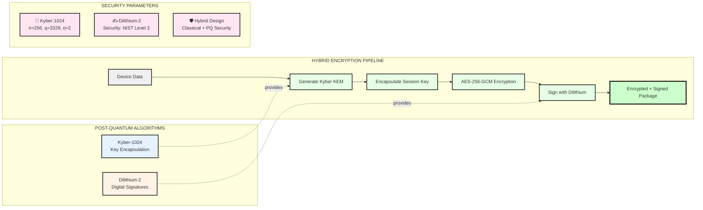
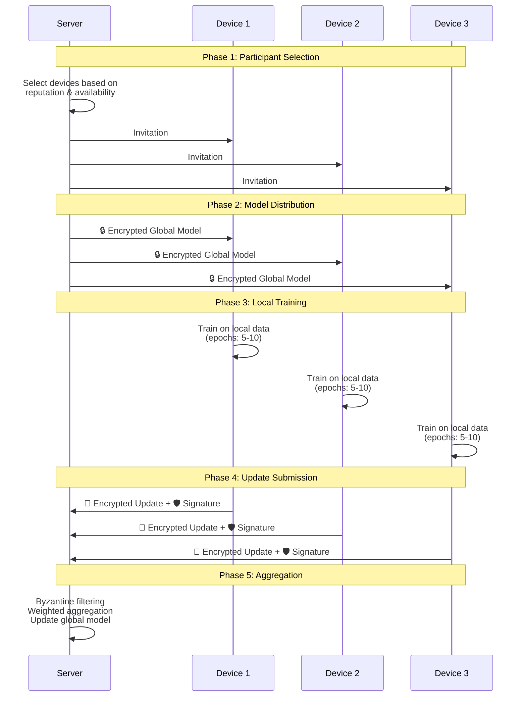
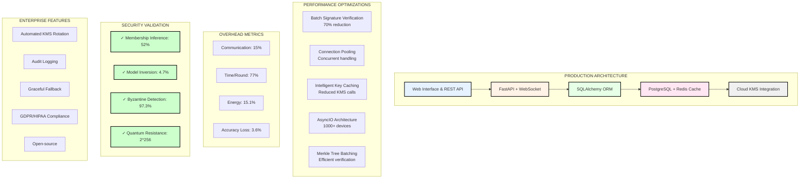
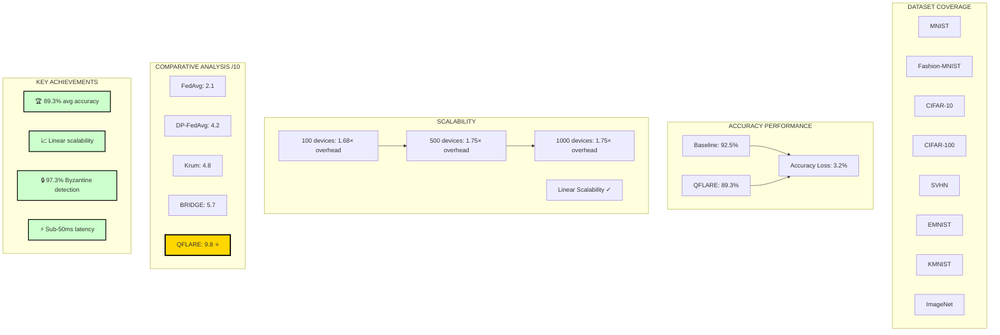
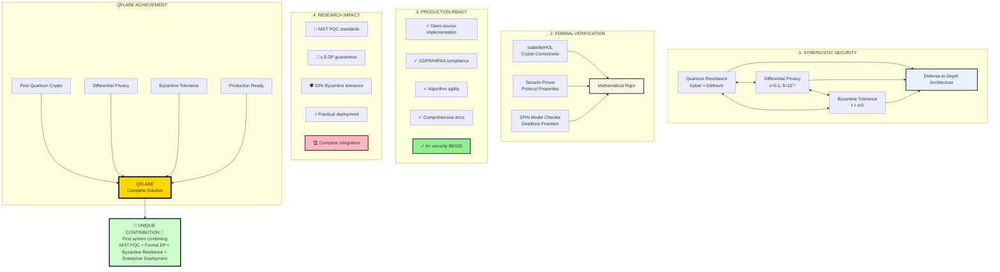

# QFLARE Methodology Slides - Mermaid Diagrams

## Slide 1: System Architecture



---

## Slide 2: Quantum-Resistant Cryptography



---

## Slide 3: Federated Training Protocol



---

## Slide 4: Differential Privacy Protection

```mermaid
graph TB
    A[Local Model Update Δw] --> B[Step 1: Gradient Clipping]
    B --> C{||Δw|| > C?}
    C -->|Yes| D[Clip: Δw' = Δw · C/||Δw||]
    C -->|No| E[Keep: Δw' = Δw]
    D --> F[Step 2: Noise Addition]
    E --> F
    F --> G[Add Gaussian Noise<br/>N~0, σ²C²]
    G --> H[Δw_private = Δw' + noise]
    H --> I[Step 3: Privacy Accounting]
    I --> J[Track ε, δ parameters]
    J --> K{ε ≤ 0.1?}
    K -->|Yes| L[✅ Accept Update]
    K -->|No| M[❌ Reject - Privacy Budget Exceeded]
    
    N[Privacy Parameters<br/>ε = 0.1, δ = 10⁻⁶<br/>C = 1.0, σ = 4.0] -.-> F
    
    style A fill:#e6f2ff,stroke:#000,stroke-width:2px
    style B fill:#fff2e6,stroke:#000,stroke-width:2px
    style D fill:#ffe6f2,stroke:#000,stroke-width:2px
    style E fill:#e6ffe6,stroke:#000,stroke-width:2px
    style F fill:#fff2e6,stroke:#000,stroke-width:2px
    style G fill:#ffe6f2,stroke:#000,stroke-width:2px
    style H fill:#e6ffe6,stroke:#000,stroke-width:2px
    style I fill:#fff2e6,stroke:#000,stroke-width:2px
    style J fill:#e6f2ff,stroke:#000,stroke-width:2px
    style L fill:#ccffcc,stroke:#000,stroke-width:3px
    style M fill:#ffcccc,stroke:#000,stroke-width:3px
    style N fill:#f0f0f0,stroke:#000,stroke-width:2px
```

---

## Slide 5: Secure Update Submission

```mermaid
graph LR
    subgraph "DEVICE SIDE"
        A[Local Model Update] --> B[Apply Differential Privacy]
        B --> C[Generate Session Key<br/>via Kyber KEM]
        C --> D[Encrypt with AES-256-GCM]
        D --> E[Sign with Dilithium]
        E --> F[Optional: Generate ZK Proof]
        F --> G[Package for Transmission]
    end
    
    subgraph "TRANSMISSION"
        G --> H[🔒 Encrypted Channel<br/>TLS 1.3 + PQ]
    end
    
    subgraph "SERVER SIDE"
        H --> I[Verify Dilithium Signature]
        I --> J{Valid?}
        J -->|No| K[❌ Reject]
        J -->|Yes| L[Decrypt Update]
        L --> M[Verify ZK Proof if present]
        M --> N{Privacy Budget OK?}
        N -->|No| O[❌ Reject]
        N -->|Yes| P[✅ Accept to Aggregation Queue]
    end
    
    style A fill:#e6f2ff,stroke:#000,stroke-width:2px
    style B fill:#fff2e6,stroke:#000,stroke-width:2px
    style C fill:#e6ffe6,stroke:#000,stroke-width:2px
    style D fill:#ffe6f2,stroke:#000,stroke-width:2px
    style E fill:#e6f2ff,stroke:#000,stroke-width:2px
    style F fill:#fff2e6,stroke:#000,stroke-width:2px
    style G fill:#e6ffe6,stroke:#000,stroke-width:2px
    style H fill:#ffffe0,stroke:#000,stroke-width:3px
    style I fill:#e6f2ff,stroke:#000,stroke-width:2px
    style L fill:#fff2e6,stroke:#000,stroke-width:2px
    style M fill:#e6ffe6,stroke:#000,stroke-width:2px
    style P fill:#ccffcc,stroke:#000,stroke-width:3px
    style K fill:#ffcccc,stroke:#000,stroke-width:3px
    style O fill:#ffcccc,stroke:#000,stroke-width:3px
```



---

## Slide 6: Byzantine-Resilient Aggregation

```mermaid
graph TB
    A[Received Updates from n Devices] --> B[LAYER 1: Cryptographic Validation]
    
    subgraph "Layer 1"
        B --> C[Verify Dilithium Signature]
        C --> D[Check Certificate]
        D --> E[Verify SHA3 Commitment]
        E --> F[Optional: Verify ZK Proof]
    end
    
    F --> G[LAYER 2: Statistical Byzantine Detection]
    
    subgraph "Layer 2 - Krum Algorithm"
        G --> H[Compute Pairwise Distances]
        H --> I[For each update, find m closest peers]
        I --> J[Calculate distance scores]
        J --> K[Identify outliers beyond threshold]
        K --> L[Apply Median Filtering]
    end
    
    L --> M[LAYER 3: Reputation Management]
    
    subgraph "Layer 3"
        M --> N[Track Rep[Di] Scores]
        N --> O{Suspicious<br/>Behavior?}
        O -->|Yes| P[Decrease: Rep ← 0.9 · Rep]
        O -->|No| Q[Maintain/Increase Reputation]
        P --> R{Rep < Threshold?}
        R -->|Yes| S[🚫 Exclude Device]
        R -->|No| T[Include in Aggregation]
        Q --> T
    end
    
    T --> U[Global Model Update]
    U --> V[Weighted Average of Valid Updates]
    
    W[🛡️ Byzantine Tolerance<br/>f < n/3] -.-> G
    
    style A fill:#e6f2ff,stroke:#000,stroke-width:2px
    style B fill:#fff2e6,stroke:#000,stroke-width:2px
    style G fill:#ffe6f2,stroke:#000,stroke-width:2px
    style M fill:#e6ffe6,stroke:#000,stroke-width:2px
    style U fill:#ccffcc,stroke:#000,stroke-width:3px
    style V fill:#90EE90,stroke:#000,stroke-width:3px
    style S fill:#ffcccc,stroke:#000,stroke-width:2px
    style W fill:#ffffe0,stroke:#000,stroke-width:2px
```

---

## Slide 7: Formal Security Analysis

```mermaid
graph TB
    subgraph "THEOREM 4: Quantum-Safe Key Exchange"
        A[Security Property: IND-CCA2]
        B[Hardness: Module-LWE<br/>n=256, q=3329, η=2]
        C[Quantum Resistance: 2^256]
        A --> B --> C
    end
    
    subgraph "THEOREM 5: Unforgeable Signatures"
        D[Security Property: EU-CMA]
        E[Hardness: Module-LWE + Module-SIS]
        F[Forgery Requirements:<br/>Hash collision OR Solve MSIS OR Distinguish MLWE]
        G[Quantum Security: 64-bit post-Grover]
        D --> E --> F --> G
    end
    
    subgraph "BYZANTINE FAULT TOLERANCE"
        H[Cryptographic Verification]
        I[Statistical Filtering - Krum]
        J[Reputation Management]
        K[Tolerance: f < n/3]
        H --> I --> J --> K
    end
    
    subgraph "SECURITY REDUCTION CHAIN"
        L[QFLARE Security] --> M[Kyber/Dilithium Security]
        M --> N[MLWE/MSIS Hardness]
        N --> O[Lattice Problems]
    end
    
    subgraph "FORMAL VERIFICATION TOOLS"
        P[Isabelle/HOL: Crypto Correctness]
        Q[Tamarin: Protocol Properties]
        R[SPIN: Deadlock Freedom]
    end
    
    style A fill:#e6f2ff,stroke:#000,stroke-width:2px
    style D fill:#fff2e6,stroke:#000,stroke-width:2px
    style H fill:#e6ffe6,stroke:#000,stroke-width:2px
    style L fill:#ffe6f2,stroke:#000,stroke-width:2px
    style P fill:#f0f0f0,stroke:#000,stroke-width:2px
    style Q fill:#f0f0f0,stroke:#000,stroke-width:2px
    style R fill:#f0f0f0,stroke:#000,stroke-width:2px
```



---

## Slide 8: Implementation & Performance



---

## Slide 9: Experimental Validation Results



---

## Slide 10: Key Methodological Innovations



---

## Usage Instructions

### To render these diagrams:

1. **GitHub/GitLab**: Paste directly into markdown files - they render natively
2. **Mermaid Live Editor**: https://mermaid.live/
3. **VS Code**: Install "Markdown Preview Mermaid Support" extension
4. **Documentation sites**: Most support Mermaid (Docusaurus, MkDocs, etc.)
5. **Export as images**: Use Mermaid CLI or online tools

### Customization:

- **Colors**: Modify `fill:#hexcolor` in style declarations
- **Shapes**: Use `[]` for rectangles, `()` for rounded, `{}` for diamonds, `[()]` for stadium
- **Arrows**: `-->` solid, `-.->` dotted, `==>` thick
- **Subgraphs**: Group related nodes for better organization

### Benefits over PNG images:

✅ **Scalable** - Vector graphics, perfect at any size
✅ **Editable** - Easy to modify text and structure
✅ **Version controlled** - Text-based, great for Git
✅ **Accessible** - Screen reader friendly
✅ **Lightweight** - Smaller file size than images
✅ **Dynamic** - Can be generated programmatically
