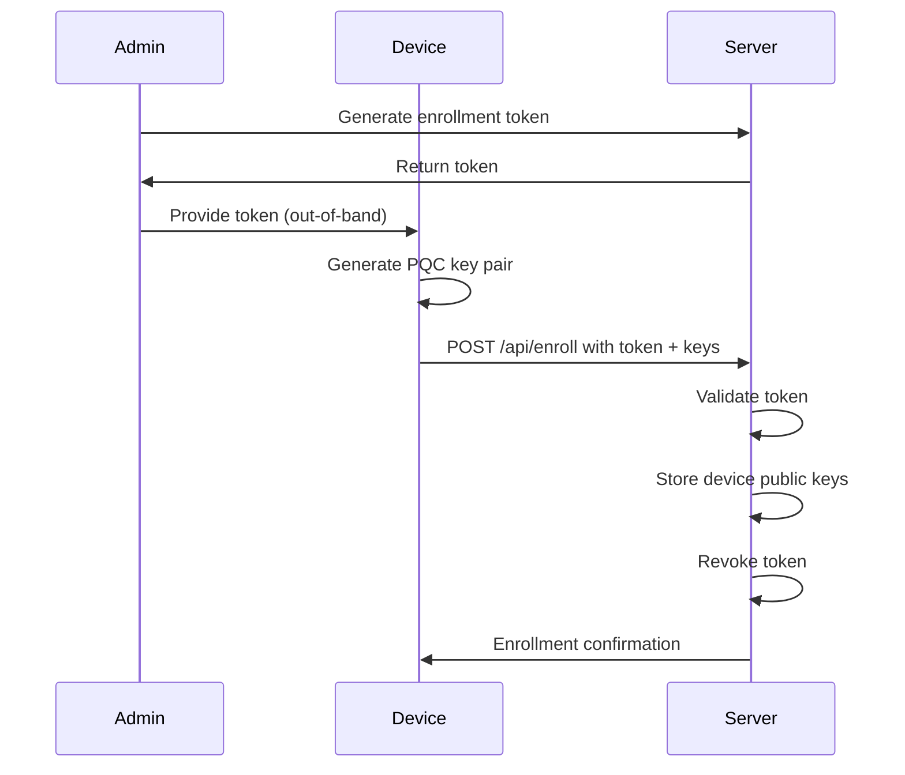
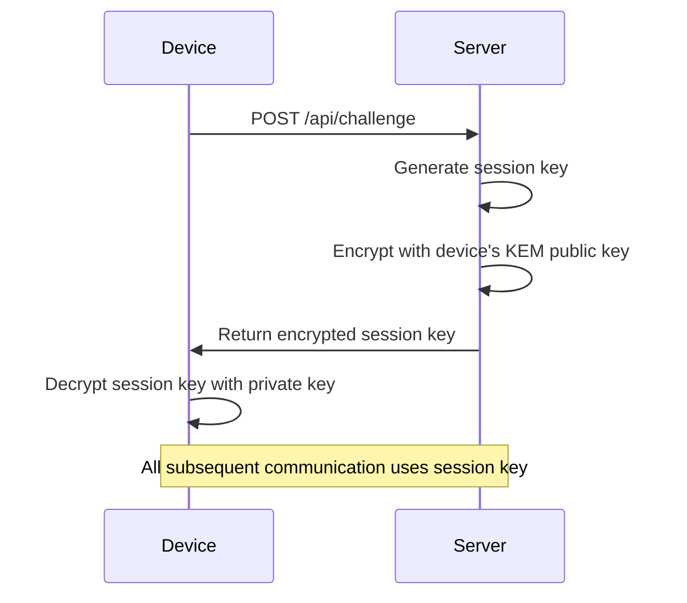
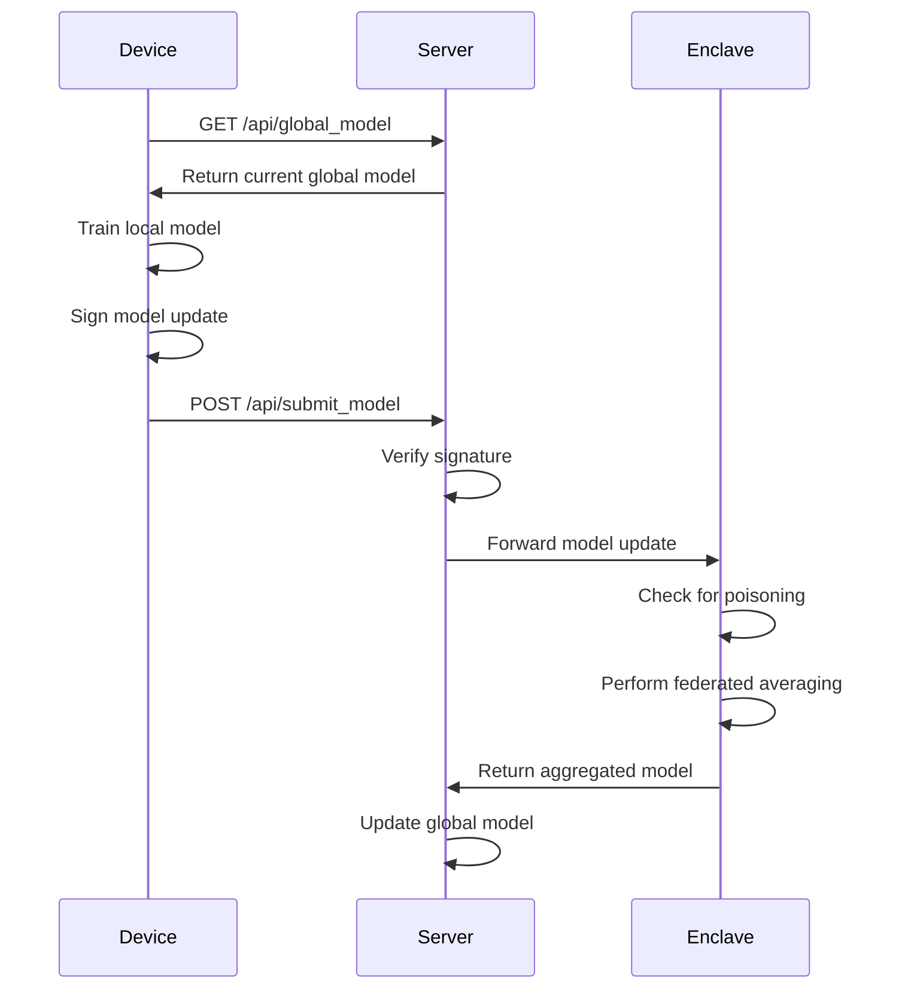

# QFLARE System Design

## Overview

QFLARE (Quantum-Resistant Federated Learning & Authentication for Resilient Edge) is a secure federated learning system that protects against both classical and quantum attacks. The system uses post-quantum cryptography and secure enclaves to ensure privacy, integrity, and authenticity in federated learning scenarios.

## Architecture

### High-Level Architecture

```
┌─────────────────┐    ┌─────────────────┐    ┌─────────────────┐
│   Edge Device   │    │  Central Server │    │  Secure Enclave │
│                 │    │                 │    │                 │
│ ┌─────────────┐ │    │ ┌─────────────┐ │    │ ┌─────────────┐ │
│ │ Local Model │ │    │ │ API Gateway │ │    │ │ Aggregation │ │
│ │ Training    │ │    │ │             │ │    │ │ Engine      │ │
│ └─────────────┘ │    │ └─────────────┘ │    │ └─────────────┘ │
│                 │    │                 │    │                 │
│ ┌─────────────┐ │    │ ┌─────────────┐ │    │ ┌─────────────┐ │
│ │ PQC Crypto  │ │    │ │ Device Reg. │ │    │ │ Poisoning   │ │
│ │ Engine      │ │    │ │             │ │    │ │ Defense     │ │
│ └─────────────┘ │    │ └─────────────┘ │    │ └─────────────┘ │
└─────────────────┘    └─────────────────┘    └─────────────────┘
```

### Component Details

#### Edge Device
- **Local Model Training**: Trains ML models on local data
- **PQC Crypto Engine**: Handles post-quantum key generation and signing
- **Secure Communication**: Establishes secure sessions with server
- **Model Update Signing**: Signs model updates with digital signatures

#### Central Server
- **API Gateway**: Handles HTTP requests and rate limiting
- **Device Registry**: Manages enrolled devices and their public keys
- **Session Management**: Handles secure session establishment
- **Model Distribution**: Distributes global models to edge devices

#### Secure Enclave
- **Model Aggregation**: Performs federated averaging securely
- **Poisoning Defense**: Detects and rejects malicious model updates
- **Memory Isolation**: Ensures sensitive operations are isolated
- **Attestation**: Provides proof of enclave integrity

## Security Model

### Threat Model

The system is designed to protect against:

1. **Quantum Attacks**: Post-quantum cryptography protects against future quantum computers
2. **Man-in-the-Middle**: TLS and digital signatures prevent tampering
3. **Model Poisoning**: Statistical analysis detects malicious updates
4. **Replay Attacks**: One-time tokens and session keys prevent replay
5. **Denial of Service**: Rate limiting and resource management
6. **Server Compromise**: Secure enclave protects sensitive operations

### Security Features

#### Post-Quantum Cryptography
- **FrodoKEM-640-AES**: Key encapsulation mechanism for secure key exchange
- **Dilithium2**: Digital signature algorithm for authentication
- **Perfect Forward Secrecy**: Session keys are ephemeral

#### Secure Enrollment
- **One-Time Tokens**: Single-use enrollment tokens prevent unauthorized access
- **Public Key Registration**: Devices register their public keys during enrollment
- **Token Revocation**: Tokens are immediately invalidated after use

#### Trusted Execution Environment
- **Memory Isolation**: Sensitive operations run in isolated memory
- **Attestation**: Cryptographic proof of enclave integrity
- **Poisoning Defense**: Statistical analysis of model updates

## Data Flow

### 1. Device Enrollment



### 2. Session Establishment



### 3. Federated Learning Round



## Implementation Details

### Post-Quantum Cryptography

The system uses the following PQC algorithms:

- **Key Exchange**: FrodoKEM-640-AES
  - Provides 128-bit post-quantum security
  - Based on Learning With Errors (LWE) problem
  - NIST PQC candidate

- **Digital Signatures**: Dilithium2
  - Provides 128-bit post-quantum security
  - Based on Module Lattice problems
  - NIST PQC candidate

### Secure Enclave

The mock enclave provides:

- **Model Aggregation**: Federated averaging of model weights
- **Poisoning Detection**: Cosine similarity analysis
- **Memory Isolation**: Simulated secure memory environment
- **Audit Logging**: Records of all aggregation operations

### Rate Limiting

The system implements rate limiting to prevent DoS attacks:

- **Enrollment**: 5 requests per minute
- **Session Challenges**: 30 requests per minute
- **Model Submission**: 10 requests per minute
- **Model Download**: 60 requests per minute

## Deployment Considerations

### Production Requirements

1. **Hardware TEE**: Replace mock enclave with Intel SGX or similar
2. **Secure Key Storage**: Use hardware security modules (HSM)
3. **Network Security**: Implement firewalls and VPNs
4. **Certificate Management**: Proper SSL/TLS certificates
5. **Monitoring**: Comprehensive logging and alerting
6. **Backup**: Regular backups of enrollment tokens and device registry

### Scalability

- **Horizontal Scaling**: Multiple server instances behind load balancer
- **Database**: Use distributed database for device registry
- **Caching**: Redis for session management and rate limiting
- **CDN**: Content delivery network for static assets

### Monitoring

- **Health Checks**: Regular monitoring of all components
- **Metrics**: Performance and security metrics collection
- **Logging**: Structured logging for audit trails
- **Alerting**: Automated alerts for security events

## Security Best Practices

### Token Management
- Rotate enrollment tokens regularly
- Use cryptographically secure random generation
- Implement token expiration and cleanup

### Key Management
- Store private keys securely (HSM recommended)
- Implement key rotation policies
- Use secure key generation procedures

### Network Security
- Use HTTPS for all communications
- Implement proper certificate validation
- Configure firewalls and access controls

### Monitoring and Auditing
- Log all security-relevant events
- Monitor for suspicious activity
- Regular security audits and penetration testing

## Future Enhancements

### Planned Features
- **Byzantine-Robust Aggregation**: Protection against malicious devices
- **Homomorphic Encryption**: Encrypted model training
- **Blockchain Integration**: Immutable audit trails
- **Real QKD**: Quantum key distribution integration

### Research Areas
- **Advanced Poisoning Defense**: More sophisticated detection methods
- **Privacy-Preserving Aggregation**: Differential privacy integration
- **Federated Learning Optimization**: Improved convergence algorithms
- **Quantum-Safe Protocols**: Next-generation PQC algorithms